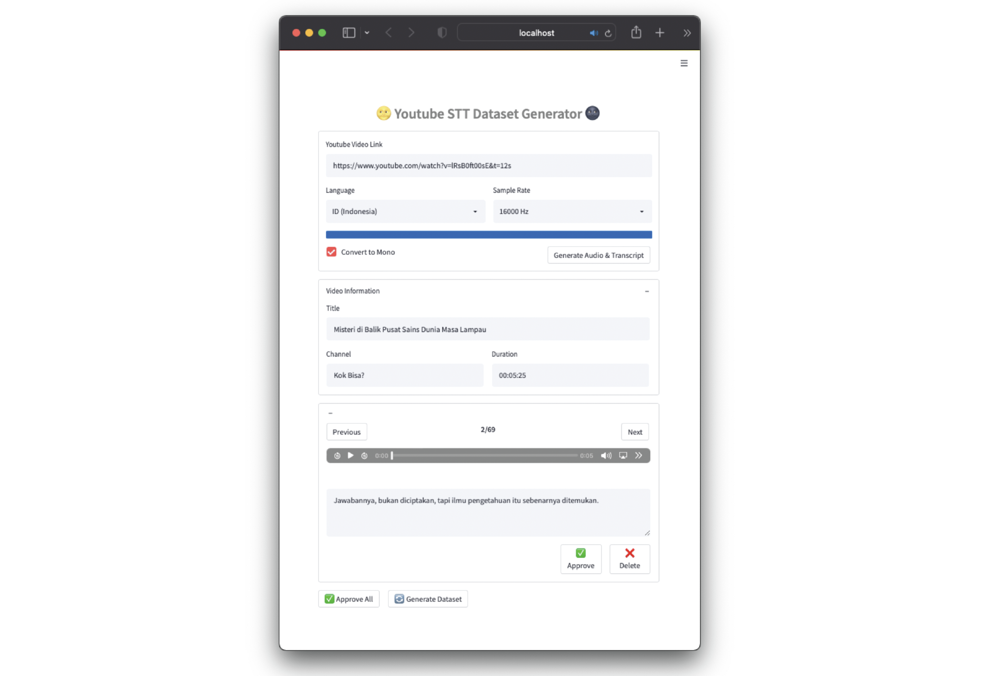

## 📝 About The Project

**YT-STT Dataset Generator** is a tool to generate **speech-to-text (STT) datasets** from **youtube videos**. This tool will download the transcript/subtitles and audio from the given youtube link and then split the audio based on the timestamp from the video transcript.

This tool also works for automatically generated subtitles and currently only supports **Indonesian** and  **English** languages.



## 🚀 Quickstart

1. Clone my repository
    ```bash
    $ git clone https://github.com/ilhamfzri/yt-stt-dataset-generator.git
    ```
2. Install requirements
    ```bash
    $ cd yt-stt-dataset-generator
    $ pip install -r requirements.txt
    ```
3. Streamlit run
    ```bash
    $ streamlit run main.py
    ```

## 📄 License

This project is licensed under the terms of the MIT license.

## 🖤 Acknowledgements
* [Streamlit](https://github.com/streamlit/streamlit)
* [YT-DLP](https://github.com/yt-dlp/yt-dlp)
* [Youtube Transcript API](https://github.com/jdepoix/youtube-transcript-api)
